# Repository Guidelines

## Project Structure & Module Organization
The app follows a modular MVVM layout. The composition root lives in `app/` (launcher shell + global wiring). Feature/business modules live in sibling directories (e.g. `anime_component/`, `local_component/`, `player_component/`, `storage_component/`, `user_component/`). `bilibili_component/` acts as an infrastructure integration module reused across features. Shared foundations are provided by `core_*` modules and `data_component/`. Build tooling resides in `buildSrc/`, and custom assets/scripts live under `document/`, `scripts/`, and `repository/`. Prefer keeping large media/prompts in dedicated folders rather than polluting module folders.

## Module Overview (based on `settings.gradle.kts`)
> Scope: only modules included via `include(...)` in `settings.gradle.kts`. The repo may contain similarly named folders that are not part of the main build.

- Total modules: `21` (`1` app + `5` feature + `1` infra integration + `7` core + `1` data + `6` bundled `repository` dependencies)
- App shell (1)
  - `:app`: app entry + shell (startup/main UI including TV), composes all modules into the final APK; also hosts global capabilities like Media3 sessions/background services.
- Feature/business modules (5)
  - `:anime_component`: anime/resource search, filters, details, follow/history (including magnet-search UI).
  - `:local_component`: local media library + playback entry; playback history; danmaku/subtitle source binding and downloads (e.g. Bilibili danmaku, Shooter subtitles).
  - `:player_component`: player capabilities + UI (Media3/VLC/mpv adapters, subtitles/ASS rendering, danmaku rendering/filtering, TV/gesture controls, caching, etc.).
  - `:storage_component`: storage + “streaming/casting” UI (file browsing, remote storage config, QR/remote scan, casting provider/receiver, etc.).
  - `:user_component`: user center + settings (login/profile, theme, player/app/developer settings, cache/scan management, about/licenses, etc.).
- Infrastructure integration modules (1)
  - `:bilibili_component`: Bilibili integration (auth/cookies, signing, playback links/MPD, danmaku download, live danmaku socket, playback heartbeat + risk-control state), reused across modules.

## Bilibili Logic Reference Project
- 参考源项目路径：`E:\Project\PiliPlus`
- 用途：当 agent 处理 Bilibili 媒体库相关逻辑时，应将 `PiliPlus` 视为“行为参考实现”来源之一，用于理解接口组织、媒体库数据流、分页/分区、收藏/历史/稍后再看、播放地址与详情页装配等实现思路。
- 适用范围：
  - `:bilibili_component` 内的接口封装、鉴权、签名、播放地址、媒体详情、弹幕相关逻辑。
  - 本仓库中依赖 Bilibili 数据源的媒体库、详情页、播放入口、历史记录、搜索/筛选等业务流程。
- 工作要求：
  - 在修改或新增 Bilibili 媒体库逻辑前，先浏览 `E:\Project\PiliPlus` 对应源码，再分析当前仓库已有实现，最后做“参考实现 -> 当前模块”的映射，不要直接照搬。
  - 优先借鉴其业务流程、字段语义、异常处理、分页策略、接口组合方式；不要直接复制与当前架构不兼容的 Flutter/Dart UI 层写法。
  - 若 `PiliPlus` 与当前仓库行为不一致，应以当前仓库架构、TV 交互约束和现有模块边界为准，并在说明中明确“参考了 PiliPlus，但进行了本地化适配”。
- 建议浏览顺序：
  1. 先看 `E:\Project\PiliPlus\lib` 下与 Bilibili 媒体库、详情、播放、历史、收藏夹相关的 repository/service/provider/controller 实现。
  2. 再看 `E:\Project\PiliPlus\android` 中与鉴权、播放器桥接、平台能力相关的 Android 侧补充实现。
  3. 最后回到本仓库的 `:bilibili_component`、`local_component`、`player_component`、`storage_component` 做映射设计。
- 搜索策略：
  - 在当前仓库或 `PiliPlus` 中查找“谁调用某接口/某类负责什么逻辑/某字段如何流转”这类源码问题时，默认优先使用 ast-grep，而不是纯文本搜索。
  - 仅在搜索字面量字符串、错误文案、资源名、配置键时使用文本搜索；若先用文本搜索定位片段，后续必须切回 ast-grep 做准确确认。
- 输出要求：
  - 若任务涉及 Bilibili 媒体库逻辑，agent 的分析或变更说明中应简要写明：
    - 参考了 `E:\Project\PiliPlus` 的哪些目录或关键文件
    - 对应映射到本仓库的哪些模块/类
    - 哪些逻辑是“参考实现”，哪些逻辑因 TV/UI/架构差异做了调整
- Core foundation modules (7)
  - `:core_contract_component`: cross-module contracts + routing (e.g. `RouteTable`), Service interfaces (file sharing/casting), playback extensions / shared Media3 session APIs.
  - `:core_system_component`: runtime/system integration (Application/startup orchestration, permissions/notifications/broadcasts, global config tables/tools, build-time injected keys/flags); may depend on `:core_log_component` to initialize logging/crash reporting early.
  - `:core_log_component`: logging + reporting infrastructure (collection/persistence, Bugly reporting, runtime log policy/sampling, subtitle/playback telemetry); initialized/wired by runtime; does not depend on `:core_system_component`.
  - `:core_network_component`: network foundations (Retrofit + Moshi, request wrappers/interceptors, shared Service/Repository plumbing).
  - `:core_database_component`: database layer (Room database management, DAO, migrations, selected local stores).
  - `:core_storage_component`: storage abstraction + implementations (multi-protocol/multi-source storage, media parsing/play proxy, danmaku/subtitle lookup, 7zip extraction, thunder download management, etc.).
  - `:core_ui_component`: shared UI foundations (BaseActivity/Fragment/ViewModel, adapters/paging, theme/focus policy, shared widgets/dialogs, etc.).
- Data model module (1)
  - `:data_component`: shared data layer (Room entities/converters, Moshi network models, business enums/parameter objects).
- Bundled repository dependency modules (6)
  - `:repository:danmaku`: wrapper for `DanmakuFlameMaster.aar` (danmaku rendering).
  - `:repository:immersion_bar`: wrapper for `immersionbar.aar` (immersive status bar).
  - `:repository:panel_switch`: wrapper for `panelSwitchHelper-androidx.aar` (panel/keyboard switch helper).
  - `:repository:seven_zip`: wrapper for `sevenzipjbinding4Android.aar` (7z extraction).
  - `:repository:thunder`: wrapper for `thunder.aar` (download-related).
  - `:repository:video_cache`: wrapper for `library-release.aar` (video caching).

## Module Dependency Layering Rules (based on current Gradle dependencies)
> Note: this is a reference for “layer semantics alignment + dependency governance”. The dependency snapshot is `document/architecture/module_dependencies_snapshot.md` (direct Gradle `project(...)` edges). Governance rules live in `document/architecture/module_dependency_governance.md` (includes DR-0001: treat `system` as runtime; allow `system -> log`).

**Design Principles**
- One-way dependencies, no cycles (dependencies only flow from “higher-level features” to “lower-level infra/contracts/data”).
- `core_*` provides reusable capabilities and must not depend on any feature module.
- Feature modules must not depend on each other (cross-feature collaboration must go through `:core_contract_component` contracts/interfaces + routing).
- `repository:*` is only for 2nd/3rd-party wrappers; depend on them directly where needed, avoid pulling them into `:app` without reason.

```mermaid
graph TD
  %% Convention: A --> B means A depends on B

  subgraph Repo["repository/* (bundled AAR dependencies)"]
    repo_danmaku[":repository:danmaku"]
    repo_immersion[":repository:immersion_bar"]
    repo_panel[":repository:panel_switch"]
    repo_seven[":repository:seven_zip"]
    repo_thunder[":repository:thunder"]
    repo_cache[":repository:video_cache"]
  end

  subgraph Base["Base layer (data/contracts only)"]
    data[":data_component"]
    contract[":core_contract_component"]
  end

  subgraph Runtime["Runtime layer"]
    system[":core_system_component"]
    log[":core_log_component"]
  end

  subgraph Infra["Infrastructure layer (replaceable implementations)"]
    network[":core_network_component"]
    db[":core_database_component"]
    bilibili[":bilibili_component"]
    storageCore[":core_storage_component"]
  end

  subgraph UI["UI foundation layer"]
    uiCore[":core_ui_component"]
  end

  subgraph Feature["Feature layer"]
    anime[":anime_component"]
    local[":local_component"]
    user[":user_component"]
    player[":player_component"]
    storageFeature[":storage_component"]
  end

  app[":app (composition root / shell)"]

  contract --> data
  system --> contract
  system --> data

  log --> data
  system --> log

  network --> system
  network --> log
  network --> data

  db --> system
  db --> data

  bilibili --> network
  bilibili --> db
  bilibili --> system
  bilibili --> log
  bilibili --> contract
  bilibili --> data

  storageCore --> contract
  storageCore --> network
  storageCore --> db
  storageCore --> system
  storageCore --> log
  storageCore --> data
  storageCore --> bilibili
  storageCore --> repo_seven
  storageCore --> repo_thunder

  uiCore --> system
  uiCore --> log
  uiCore --> contract
  uiCore --> data
  uiCore --> repo_immersion

  anime --> uiCore
  anime --> system
  anime --> log
  anime --> network
  anime --> db
  anime --> storageCore
  anime --> contract
  anime --> data

  local --> uiCore
  local --> system
  local --> log
  local --> network
  local --> storageCore
  local --> db
  local --> bilibili
  local --> contract
  local --> data

  user --> uiCore
  user --> system
  user --> log
  user --> network
  user --> db
  user --> storageCore
  user --> bilibili
  user --> contract
  user --> data

  player --> uiCore
  player --> system
  player --> log
  player --> storageCore
  player --> network
  player --> db
  player --> contract
  player --> data
  player --> repo_danmaku
  player --> repo_cache

  storageFeature --> uiCore
  storageFeature --> system
  storageFeature --> log
  storageFeature --> network
  storageFeature --> db
  storageFeature --> storageCore
  storageFeature --> bilibili
  storageFeature --> contract
  storageFeature --> data

  app --> anime
  app --> local
  app --> user
  app --> player
  app --> storageFeature
  app --> system
  app --> log
  app --> uiCore
  app --> contract
  app --> data
```

## Build, Test, and Development Commands
Use Gradle from repo root:
- `./gradlew assembleDebug` – fast developer build with logging enabled.
- `./gradlew assembleRelease` – optimized, signed release artifacts.
- `./gradlew clean build` – full rebuild to validate cross-module wiring.
- `./gradlew dependencyUpdates` – report outdated libraries defined in `build.gradle.kts`.
- `./gradlew verifyModuleDependencies` – module dependency governance check (v2), verifies direct `project(...)` dependencies against the allowed matrix/whitelist.
- `./gradlew testDebugUnitTest` and `./gradlew connectedDebugAndroidTest` – run JVM unit tests and device/emulator instrumentation respectively.

### Build Verification Requirement
- Always read the tail of Gradle output and confirm whether it ends with `BUILD SUCCESSFUL` or `BUILD FAILED` before reporting status to the user. Do **not** assume success just because tasks ran; explicitly mention failures when they occur.

## Coding Style & Naming Conventions
Stick to the Kotlin version configured by the repo (currently 1.9.25), with 4-space indentation, explicit visibility, and trailing commas disabled. View models live under `.../presentation` or `.../viewmodel` packages; fragments/activities use DataBinding layouts named `fragment_<feature>.xml` or `activity_<feature>.xml`. ARouter paths follow `/module/Feature`. Prefer extension functions for shared logic and keep shared helpers in appropriate `core_*` modules (often under `com.xyoye.common_component.*` packages), instead of duplicating them in feature modules. Lint via `./gradlew lint` before sending patches and let ktlint settings in root Gradle/buildSrc drive formatting rather than ad-hoc style tweaks.

## Testing Guidelines
Place JVM tests in `*/src/test/java` and instrumentation suites in `*/src/androidTest/java`; name files `<Class>Test.kt` or `<Feature>InstrumentedTest.kt` so Gradle discovers them. Cover parsing, player helpers, and data-layer conversions with unit tests, and reserve playback/integration flows for instrumentation backed by an emulator with media files in `storage_component`. Failing tests should block the PR, so run `testDebugUnitTest` locally and attach emulator logs when `connectedDebugAndroidTest` fails.

### 本机 AVD 环境基线
- 当前系统已安装 Android SDK，`ANDROID_SDK_ROOT` / `ANDROID_HOME` 均指向 `C:\Android\Sdk`。
- 当前检测到的 AVD:
  - `Pixel_5_API_34`
- 当前 `adb devices -l` 状态:
  - `emulator-5554 offline`
- 当前未检测到活动中的 `emulator.exe` / `qemu-system-*` 进程，因此 `emulator-5554 offline` 更像是残留的 adb 会话，而不是可用中的模拟器实例。
- 在继续执行仪器测试前，必须先确认设备处于 `device` 状态；若仍为 `offline`，优先执行：
  - `adb kill-server`
  - `adb start-server`
  - `adb devices -l`
- 如需手动启动本机 AVD，优先使用 SDK 绝对路径，避免 PATH 歧义：
  - `C:\Android\Sdk\emulator\emulator.exe -avd Pixel_5_API_34`

### 软件测试方法
- 单元测试：
  - 适用于 ViewModel、工具类、解析逻辑、Room/Moshi 转换、播放器辅助逻辑。
  - 命令：`./gradlew testDebugUnitTest`
- 仪器测试：
  - 适用于页面导航、Room/系统服务集成、需要 Android Framework 的行为验证。
  - 命令：`./gradlew connectedDebugAndroidTest`
  - 前提：至少一个模拟器或真机处于 `device` 状态，禁止在 `offline`/`unauthorized` 状态下宣称测试通过。
- 冒烟测试：
  - 每次修改播放器、存储、TV 焦点或启动流程后，至少验证“启动应用 -> 进入核心页面 -> 执行一次返回/播放/设置操作 -> 退出页面”。
  - TV 相关改动必须只用 DPAD 完成一次主路径验证，并确认焦点可见、可达、可返回。
- 回归测试：
  - 涉及 `player_component`、`storage_component`、`local_component`、`user_component` 的交互改动时，除对应模块功能外，还要补测设置持久化、页面返回栈、异常提示与恢复路径。
- 构建验证：
  - 至少执行一次与改动范围匹配的 Gradle 构建或测试命令。
  - 汇报结果前，必须查看 Gradle 输出尾部，明确确认是 `BUILD SUCCESSFUL` 还是 `BUILD FAILED`。

### 基于 AVD 的推荐测试流程
1. 检查设备状态：
   - `adb devices -l`
2. 若没有可用设备，启动 AVD：
   - `C:\Android\Sdk\emulator\emulator.exe -avd Pixel_5_API_34`
3. 等待设备完成启动：
   - `adb -s emulator-5554 wait-for-device`
   - `adb -s emulator-5554 shell getprop sys.boot_completed`
4. 安装并执行测试：
   - `./gradlew installDebug`
   - `./gradlew connectedDebugAndroidTest`
5. 失败时保留证据：
   - `adb -s emulator-5554 logcat -d`
   - 如需界面证据，可补充 `adb -s emulator-5554 exec-out screencap -p > <path>`

### 模拟器交互式测试建议
- 优先使用 `adb` 驱动的可复现操作，而不是只凭手工点击描述问题。
- 推荐流程：
  - `adb -s emulator-5554 shell am start -n <package>/<activity>`
  - `adb -s emulator-5554 exec-out uiautomator dump /dev/tty`
  - `adb -s emulator-5554 shell input keyevent 19|20|21|22|23|4`
- 说明：
  - `19/20/21/22/23/4` 分别对应 `DPAD_UP`、`DPAD_DOWN`、`DPAD_LEFT`、`DPAD_RIGHT`、`DPAD_CENTER`、`BACK`。
  - 对 TV 页面，提交前应至少覆盖一次纯 DPAD 导航，不允许只验证触摸路径。

## Commit & Pull Request Guidelines
Recent history uses the `<type>: 
` pattern (`fix: ...`, `refactor: ...`); keep summaries under ~60 characters and describe scope (e.g., `player_component`). Squash noisy WIP commits before pushing. PRs must include: purpose, affected modules, test evidence (command + result), and UI screenshots when touching layouts. Link GitHub issues and note any required configuration toggles (`IS_APPLICATION_RUN`, `IS_DEBUG_MODE`).

## Security & Configuration Tips
Sensitive tokens belong in `local.properties` or Gradle properties; never hard-code keys. Toggle `IS_DEBUG_MODE` and `IS_APPLICATION_RUN` in `gradle.properties` when enabling verbose logs or single-module runs, then rebuild so the flags propagate. Follow the comments in `local.properties.template` for Bugly crash reporting credentials setup, and remember the `user_component` ships with remote APIs disabled—avoid re-enabling interfaces without coordinator approval to keep builds distributable.

## TV/Remote UX
本仓库以 TV 端交互为先（Leanback + 遥控器 DPAD），移动端保持可用。涉及 UI 与交互时，请以“可达性/一致性/可维护性”为优先级，而不是最小侵入。

### 1) 分流与判定
- 统一使用 `Context.isTelevisionUiMode()` 判定 TV UI mode（定义在 `core_ui_component`），不要在业务模块重复实现判断逻辑。
- 分流优先级（从大到小）：
  1. **结构差异大**：使用独立入口或独立页面（例如 `MainActivity` vs `TvMainActivity`）。
  2. **同屏小差异**：用运行时 `isTelevisionUiMode()` 做显隐/交互分流，避免大规模复制 layout。
  3. **纯视觉差异**：优先用 `*-television` 资源覆盖（尤其是 `state_focused` 的 selector/描边/overlay），避免复制整套布局。
- “TV 默认裁剪/关闭”的能力必须明确属于哪一种策略：
  - **仅 TV 禁用**：必须基于 `isTelevisionUiMode()` 分流，避免误伤移动端。
  - **全端禁用**：必须在代码/文档中明确为产品决策，不要以“TV 适配”为名做静默 stub。

### 2) DPAD / 焦点规范（强约束）
- TV 端必须保证“焦点可达、可见、可反馈、可返回”。任何控件的新增/显隐/顺序调整都需要验证 DPAD 导航路径无死角。
- 列表/网格（RecyclerView）建议规范：
  - Item 的默认焦点目标使用 `android:tag="@string/focusable_item"` 标注（必要时也可用 `FocusTarget` 指定子 View）。
  - 列表页优先接入 `RecyclerViewFocusDelegate` 统一处理：DPAD 上下移动、焦点保存/恢复、MENU/SETTINGS 键动作。
  - 进入页面时，在非触摸模式下必须有明确的默认焦点（避免“无焦点/焦点落在不可见 View”）。
- 可点击控件建议规范：
  - DPAD 模式下以 `state_focused` 作为主反馈（selector + `tv_focus_*` 颜色/描边），不要只依赖 `state_pressed`。
  - 同一行左右导航尽量显式配置 `nextFocusLeftId/nextFocusRightId`，避免焦点跳转到不可预期区域。
  - 需要动态启用/禁用焦点时，优先使用 `FocusPolicy.applyDpadFocusable(...)` / `View.applyDpadFocusable(...)`。

### 3) 按键语义（建议）
- `BACK`：优先关闭弹窗/设置面板/控制条；仅当栈空时才执行“二次返回退出”等全局逻辑。
- `MENU/SETTINGS`：在 TV 列表场景可作为“刷新/设置入口”的快捷键（按页面语义决定，并保持同类页面一致）。

### 4) 输入与确认策略（TV 友好）
- TV 端避免依赖 `EditText + 软键盘 + IME_ACTION_DONE` 完成关键配置；对数字/枚举类设置优先使用 DPAD 左右步进/切换控件。
- TV 端优先“修改即生效 + 自动持久化”，减少额外“确定/取消”的确认成本；若必须显式动作（扫码登录/测试连接/投屏连接等），动作成功后自动保存并返回一致的结果语义。

### 5) 触摸/手势
- 依赖触摸手势的交互在 TV UI mode 下应禁用或替换为纯 DPAD 逻辑；不要向 TV 用户暴露无法触发的入口。

### 6) 提交前自检（TV 回归）
- 全程仅用遥控器 DPAD 可完成核心路径（进入/选择/配置/返回/播放/退出）。
- 不存在“焦点陷阱/焦点丢失/隐藏视图抢焦点”；列表滚动与页面返回后焦点可恢复。
- 所有可操作控件均有清晰 focused 反馈（视觉高亮一致、可辨识）。

## Active Technologies
- Kotlin `1.9.25`（JVM target `1.8`）、Android Gradle Plugin `8.7.2`、Gradle `8.9`
- AndroidX（Lifecycle/ViewModel、Room、Preference、RecyclerView、Startup 等）、Kotlin Coroutines、ARouter
- 网络与数据：Retrofit + OkHttp、Moshi、Room、MMKV
- 播放与媒体：Media3（可开关）、ExoPlayer 2、VLC、弹幕/字幕渲染、本地代理（NanoHTTPD）
- 存储与集成：Bilibili 能力集成、多协议存储、7zip、thunder、video cache
- 工程与质量：ktlint（`org.jlleitschuh.gradle.ktlint`）、JaCoCo、SonarCloud workflow（`SonarSource/sonarqube-scan-action@v6`）
- 测试：JUnit4、AndroidX Test、Robolectric `4.16.1`、Kotlin Coroutines Test
